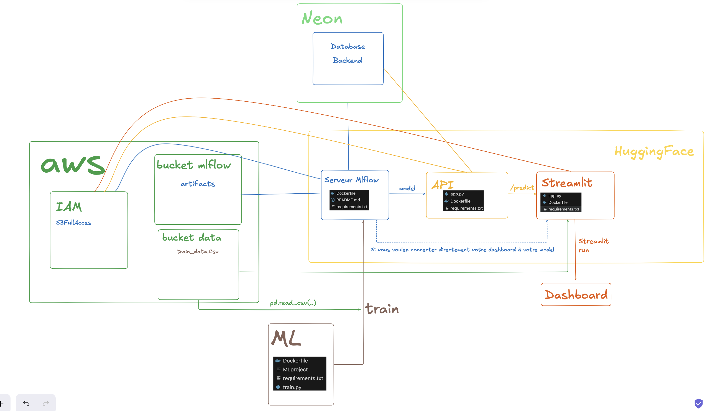

# 🚀 Full-Stack Machine Learning Deployment : IBM Attrition

Ce projet est un guide complet pour déployer une solution de Machine Learning "end-to-end". L'objectif est de prédire le départ des employés (**attrition**) en utilisant une stack moderne : **MLflow**, **FastAPI**, **Streamlit** et **Docker**, le tout orchestré via **AWS** et **Hugging Face**.

---

## 🏗️ Architecture du Projet

Le schéma ci-dessous illustre l'interaction entre les différents services de l'infrastructure :



### Flux de données :

1.  **Serveur MLflow** (Hugging Face) : Centralise les expériences et le registre de modèles. Il utilise une base de données **Neon** (PostgreSQL) pour le backend et un bucket **AWS S3** pour les artefacts.
2.  **Entraînement** (MLProject) : Entraînement d'un modèle Random Forest conteneurisé qui envoie ses métriques et le modèle final vers MLflow.
3.  **API de Prediction** (FastAPI) : Récupère dynamiquement le modèle depuis MLflow (via un alias comme `challenger`) et expose un point de terminaison `/predict`.
4.  **Interface Utilisateur** (Streamlit) : Dashboard interactif pour visualiser les données IBM et simuler des prédictions via l'API.

---

## 📁 Arborescence du Repo

```text
full-deployment-project/
├── api_demo/               # Serving du modèle via FastAPI
│   ├── app.py
│   ├── Dockerfile
│   └── requirements.txt
├── mlflow/                 # Configuration du serveur de tracking
│   ├── .env
│   ├── Dockerfile
│   └── requirements.txt
├── streamlit-app/          # Interface Utilisateur (Dashboard)
│   ├── app.py
│   ├── Dockerfile          # Configuration spécifique Hugging Face (User 1000)
│   └── requirements.txt    # Dépendances frontend et data
├── train_repo/             # Phase d'entraînement (MLProject)
│   ├── docker/
│   │   ├── Dockerfile
│   │   └── requirements.txt
│   ├── MLProject           # Orchestration du run Docker
│   ├── train.py            # Script d'entraînement Random Forest
│   └── secrets.sh          # Export des clés AWS et MLflow (A NE PAS COMMIT)
├── conda.yaml              # Environnement local pour le développement
└── schema_archi_api.jpg    # Schéma de l'architecture
```

---

## 🛠️ Guide d'installation

### 1. Préparation de l'environnement local

Pour tester vos scripts ou explorer les données dans le notebook `train_dev.ipynb`, créez l'environnement Conda dédié :

```bash
conda env create -f conda.yaml
conda activate mlflow-train
```

> **Note** : Cette commande installe Python 3.11 ainsi que toutes les dépendances nécessaires, notamment MLflow 3.5.0 et Scikit-Learn 1.6.1.

### 2. Déploiement du Serveur MLflow

Avant tout entraînement, votre serveur de tracking doit être actif :

1.  Déployez le contenu du dossier `mlflow/` sur un **Hugging Face Space** (Docker).
2.  Configurez les variables d'environnement dans les "Settings" du Space :
    - `BACKEND_STORE_URI` : Votre URL de connexion PostgreSQL (Neon.tech).
    - `AWS_ACCESS_KEY_ID` / `AWS_SECRET_ACCESS_KEY` : Vos identifiants IAM AWS.
    - `ARTIFACT_ROOT` : Le nom de votre bucket S3 (ex: `s3://votre-bucket-mlflow/`).

### 3. Entraînement avec MLProject

Le fichier `MLProject` permet de lancer l'entraînement dans un conteneur isolé pour garantir la reproductibilité.

1.  Remplissez vos accès dans le fichier `secrets.sh`.
2.  Lancez le run via la commande suivante :
    ```bash
    source secrets.sh
    mlflow run . --experiment-name ibm_attrition_detector --n_estimators=100 --min_samples_split=2
    ```
3.  Le script `train.py` utilise l'**autologging** de MLflow pour enregistrer les paramètres et métriques, puis enregistre le modèle final sous l'alias **"challenger"**.

### 4. Déploiement de l'API (FastAPI)

L'API récupère dynamiquement le modèle depuis votre registre MLflow.

1.  Vérifiez que la variable `MLFLOW_TRACKING_URI` pointe vers votre serveur déployé à l'étape 2.
2.  Déployez le dossier `api_demo/` sur un nouveau Space Hugging Face.
3.  Une documentation interactive (Swagger) est automatiquement disponible sur le point de terminaison `/docs`.

### 5. Dashboard Streamlit

L'interface finale permet aux utilisateurs d'interagir avec le modèle :

1.  Dans `streamlit-app/app.py`, mettez à jour la variable `API_URL` avec l'adresse de votre Space API.
2.  Déployez le dossier sur Hugging Face.
3.  **Configuration Docker** : Le `Dockerfile` est configuré pour exposer le port 7860 et utilise l'utilisateur 1000 (ID standard Hugging Face) pour éviter tout problème de permission.

---

## 🔑 Variables d'Environnement Requises

| Variable                | Description                                    |
| :---------------------- | :--------------------------------------------- |
| `MLFLOW_TRACKING_URI`   | URL de votre serveur MLflow sur Hugging Face   |
| `AWS_ACCESS_KEY_ID`     | Clé d'accès AWS pour le stockage S3            |
| `AWS_SECRET_ACCESS_KEY` | Clé secrète AWS                                |
| `BACKEND_STORE_URI`     | URI de connexion PostgreSQL (Neon) pour MLflow |

---

> **Note importante** : Pour le déploiement sur Hugging Face, assurez-vous d'utiliser l'instruction `COPY --chown=user . $HOME/app` dans vos Dockerfiles pour garantir les droits de lecture/écriture au runtime.
